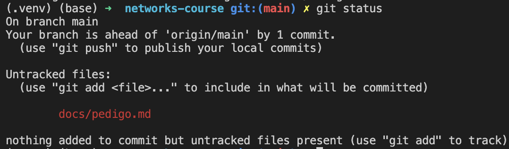
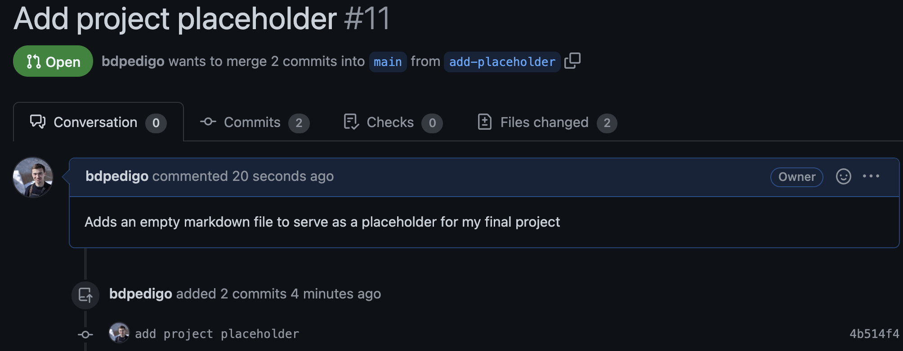
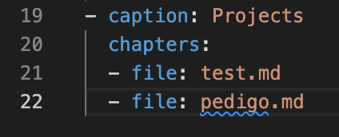

# Mini-assignment 
```{note}
This assignment is based on the wonderful `first-contributions` page: https://github.com/firstcontributions/first-contributions/blob/master/README.md

If you have trobule with my instructions below, I suggest completing the very quick `first-contributions` tutorial, and see if that helps you understand the process of making a pull request.
```
- Make sure you have `git` installed: https://git-scm.com/book/en/v2/Getting-Started-Installing-Git
- Make sure you have a GitHub (free/student) account: https://docs.github.com/en/get-started/signing-up-for-github/signing-up-for-a-new-github-account
- From the command line on your machine, navigate to a folder where you would like to keep your work for the course
- Go to the page for this repo: https://github.com/bdpedigo/networks-course
- Find the `Fork` button (top right) and use it to fork this repo to your own account. This essentially makes a copy of this repo which you can modify as you please. 
  
- Find the green `Code` button on your fork (not the main page as shown here). Note that for all of the subsequent steps, the repo should be `<your username>/networks-course` instead of mine.
  
- Hit the green `Code` button and copy the `HTTPS` link: 
  
- From the command line, do `git clone <link that you just copied>`
- You should now see a directory called `networks-course`
- From the command line, make sure you are in the `networks-course` directory. You probably need to move there with a command like `cd networks-course`. 
- Create and switch to a new branch by doing `git checkout -b add-placeholder`
  
- Make a new file in the directory `networks-course/docs`, call it `<your-last-name>.md`:
  
- In that file, write `# <your last name> - final project placeholder`:
  
- Use `git` to check for modified files via `git status`: 
   
- Do `git add docs/<your last name>.md` to add this new file to be tracked. You can use `git status` again to verify if this worked
   
- Do `git commit -m "add project placeholder"`. A commit is like a bundle of code modifications, and the `-m` allows you to write a message (like a title) to be associated with that commit.
  
- Do `git push` to send these changes to be reflected online. Note that you main need to do `git push --set-upstream origin add-placeholder` in order for this to work (like I did below). 
  
- Go to your repo on GitHub again. You will likely see a prompt to make a pull request. If not, navigate to the pull request tab and hit `New pull request`.
- You should see a page with options for a `base` and a `compare`. `base` should be `bdpedigo/main`, and `compare` should be `<your username>/add-placeholder`. 
- Add a brief title and description to the pull request. Mine looks like this: 
  
- Now, we need to make one more change prior to being done with this pull request. Find the file `networks-course/docs/_toc.yml`, and add your new file to this table of contents page. Under the `projects` chapter, add a new file with just your name (line 22). This just tells `jupyter-book`, the package that builds the website, to look for your new page. Note that the indentation here is important.    
  
- Repeat the steps above to add a file (`git add`), commit the changes (`git commit`), and push to the remote repository (`git push`). Note that your changes will be reflected in the pull request without having to do anything else.
- On the pull request page online, you can hit `Files changed` to preview the changes you have proposed. It should look something like the screenshot below. Note that you should only be changing these two files (adding a new `.md` file, and modifying `_toc.yml`).
  
- If you have opened a pull request with only these two files changed, and the modifications followed all of the steps above, you are done!