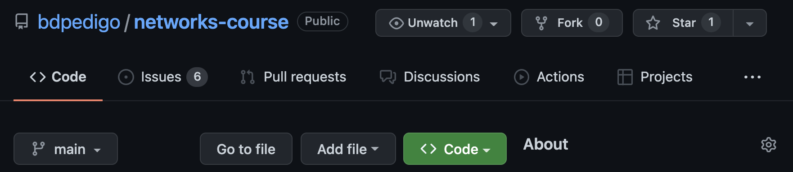
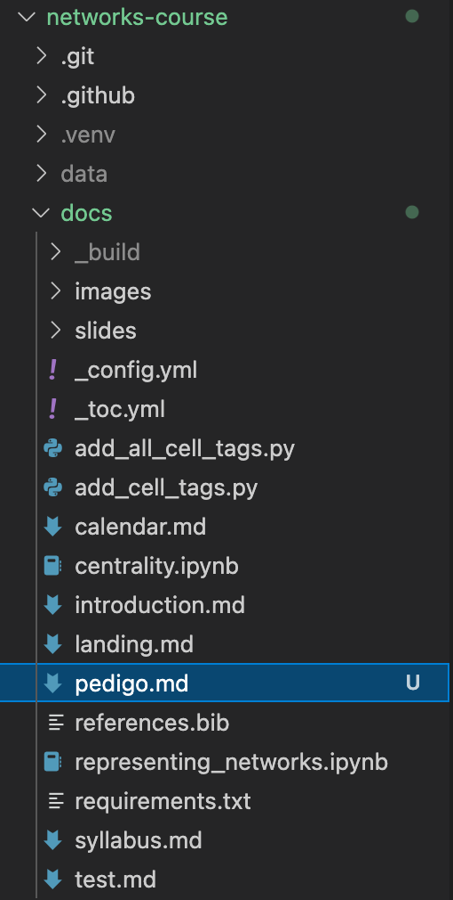
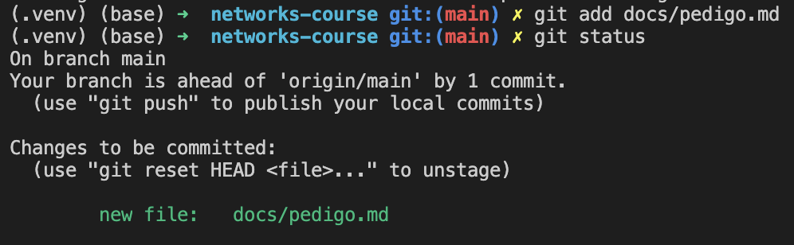
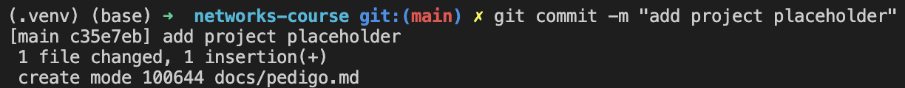

# Mini-assignment 

- Make sure you have `git` installed: https://git-scm.com/book/en/v2/Getting-Started-Installing-Git
- Make sure you have a GitHub (free/student) account: https://docs.github.com/en/get-started/signing-up-for-github/signing-up-for-a-new-github-account
- From the command line on your machine, navigate to a folder where you would like to keep your work for the course
- Go to the page for this repo: https://github.com/bdpedigo/networks-course
- Find the `Fork` button (top right) and use it to fork this repo to your own account. This essentially makes a copy of this repo which you can modify as you please. 
  
- Find the green `Code` button on your fork (not the main page as shown here):
  
- Hit the green `Code` button and copy the `HTTPS` link: 
  
- From the command line, do `git clone <link that you just copied>`
- You should now see a directory called `networks-course`
- Make a new file in the directory `networks-course/docs`, call it `<your-last-name>.md`:
  
- In that file, write `# <your last name> - final project placeholder`:
  
- From the command line, make sure you are in the `networks-course` directory. You probably need to move there with a command like `cd networks-course`. 
- Use `git` to check for modified files via `git status`: 
   
- Do `git add docs/<your last name>.md` to add this new file to be tracked. You can use `git status` again to verify if this worked
   
- Do `git commit -m "add project placeholder"`. A commit is like a bundle of code modifications, and the `-m` allows you to write a message (like a title) to be associated with that commit.
  
- Do `git push` to send these changes to be reflected online: 
  
