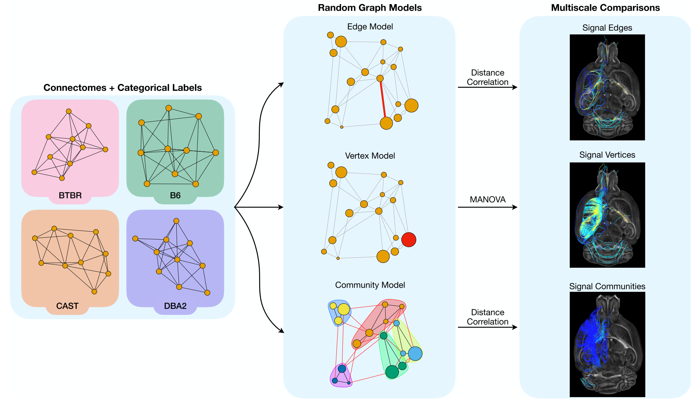
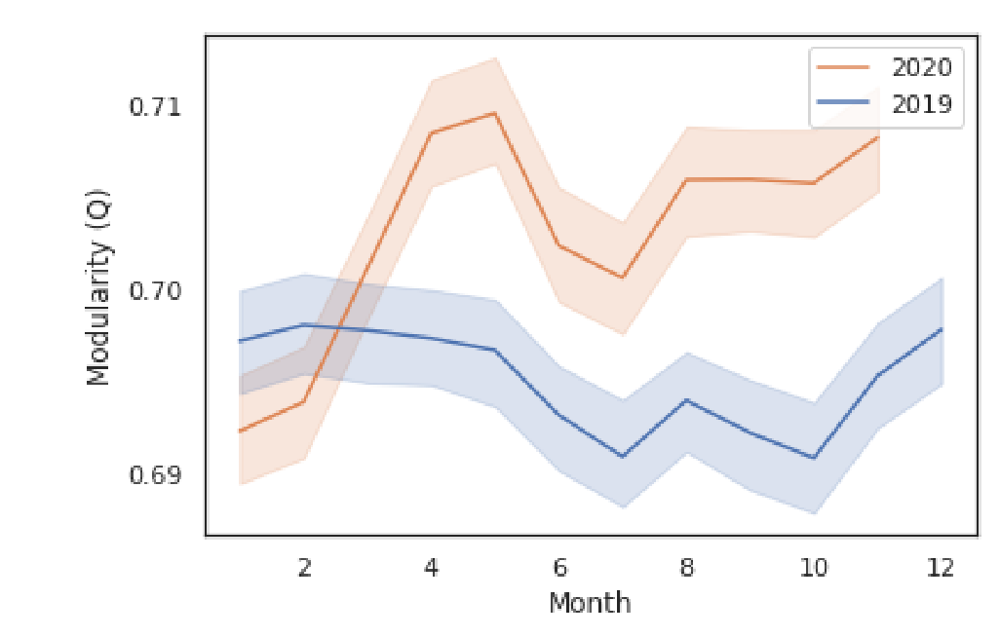
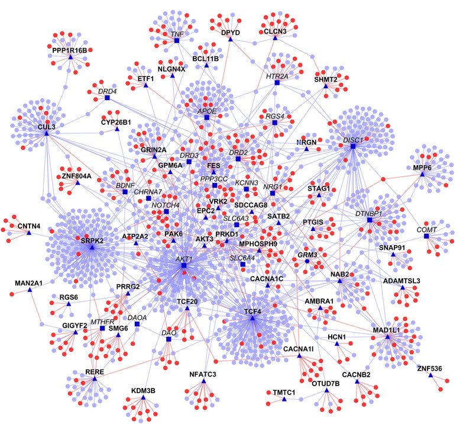

# What are networks (and why should you care)?

---
# What are networks?
- Networks are a mathematical way of representing a set of objects and the relationships among them.
- These "objects" are termed **nodes** or **vertices**.
- These relationships are termed **edges** or, less often, **links**.
- Networks are also called **graphs**.

---

# Example networks / applications

---
# Connectome

Nodes: neurons, edges: some # of synapses

---
# More connectome 

<footer>

</footer>

---
# Enron anomaly prediction

---
# MSR communication

<!-- Nodes: email accounts, edges: some # of emails -->

<footer>

[*Advancing organizational science using network machine learning to measure innovation in the workplace*](https://www.microsoft.com/en-us/research/blog/advancing-organizational-science-using-network-machine-learning-to-measure-innovation-in-the-workplace/)
[Zuzul et al. arXiv:2104.00641 (2021)](https://arxiv.org/abs/2104.00641)

</footer>

---
# Faculty hiring and other dominance hierarchies

<footer>

</footer>

---
# Pandemic spread

<footer>

</footer>

---
# Protein-protein interaction

<footer>

https://www.ncbi.nlm.nih.gov/pmc/articles/PMC4898894/#!po=16.6667

</footer>

---
# What are NOT networks? - Hypergraphs
- Networks represent **dyadic** relationships: interactions between *two* things.
  - Example: an email from me to you  
- **Polyadic** relationships (interactions between more than two things) are common.
  - Example: an email from me to you AND someone else
- We could ignore this: 
  - Make an edge from me to you.
  - Make another, separate edge from me to someone else.
- **Hypergraphs** are a mathematical way of representing general polyadic relationships.

---
# What are NOT networks? - Multigraphs
- Graphs (strictly speaking) usually have at most one edge between node $i$ and node $j$.
- There may be multiple relationships between two nodes in data that we want to model.
  - Example: An email from me to you, and a phone call from me to you.
- Sometimes we can compress this information into at most one edge, and still use a graph.
  - Example: Create an edge if there was an email OR a phone call.
- **Multigraphs** allow for more than one edge from node $i$ to node $j$.

---

# Every time we represent something in the real world with a network, we're making a modeling choice

---
# What can we do with networks? (i.e. What is this class about?)

## [Class Calendar](https://bdpedigo.github.io/networks-course/calendar.html)

---
# Appendix

---
# The Wire

--- 
# Sports

--- 
# Prediction/supervised learning 

---
# Networks are a backbone in many modern ML algorithms

